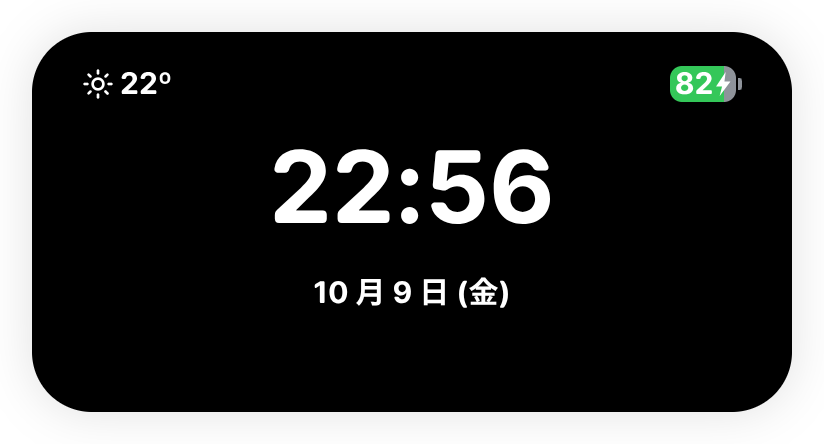

<p align="center">
  
</p>

<h1 align="center">Ripple Next</h1>

<p align="center"><strong>次の操作を、すぐ手元に。</strong></p>
<p align="center">Windows・macOS・Linux で使える Dynamic Island デスクトップアシスタント。</p>

<p align="center">
  <a href="README.zh-CN.md">简体中文</a> ·
  <a href="README.zh-TW.md">繁體中文</a> ·
  <a href="README.md">English</a> ·
  <strong>日本語</strong>
</p>

<p align="center">
  <a href="https://github.com/ArsvineZhu/Ripple-Next/releases">ダウンロード</a> ·
  <a href="instructions.md">使い方（英語）</a> ·
  <a href="https://github.com/ArsvineZhu/Ripple-Next/issues">問題を報告</a>
</p>

音楽を一時停止したい。URL を開きたい。さっきコピーしたコマンドをもう一度使いたい。やることをひとつ思い出した。Ripple Next は、こうした小さな操作をデスクトップ上のひとつの島にまとめます。ウィンドウを探す手間を減らして、作業を続けられます。

普段はコンパクトに、ポインターを重ねると簡単な情報を、クリックすると機能ページを表示。内容に合わせてサイズが変わり、ページはアニメーションで切り替わります。島の外側はそのままデスクトップをクリックできます。

<p align="center">
  
</p>

> スクリーンショットは実際の Linux アプリで撮影しました。メディア、AI の回答、クリップボード、天気、バッテリーにはデモデータを使っています。更新内容は [4.0.0 リリースノート（英語）](docs/releases/4.0.0.en.md)をご覧ください。

## 8 つのページを、ひとつの場所に

| ページ                           | できること                                                                                                                                       |
| -------------------------------- | ------------------------------------------------------------------------------------------------------------------------------------------------ |
| **ブラウザー検索**               | 検索語や HTTP(S) アドレスを既定のブラウザーで開く。検索 URL のテンプレートも変更できます。                                                       |
| **ワークフローとクイックアプリ** | アプリと Web ページの組み合わせを順に開く、またはお気に入りを個別に起動。インストール済みアプリ、URL、引数を個別に指定するコマンドに対応します。 |
| **概要**                         | 時刻・日付・天気・バッテリーをまとめて確認。12／24 時間表示、タイムゾーン、天気の場所、摂氏／華氏を選べます。                                    |
| **再生中**                       | 曲名とアートワークを表示し、一時停止・再開・曲送り・プレイヤーの表示を操作。複数のプレイヤーは縦スクロールで選べます。                           |
| **AI アシスタント**              | 自分の OpenAI 互換エンドポイントとモデルを使用。ストリーミングの Markdown 回答を読み、コードブロックをコピーできます。                           |
| **クリップボード**               | 最近コピーしたテキストを各項目のボタンで再利用。履歴は現在のセッションだけに残ります。                                                           |
| **タスク**                       | 思いついたタスクを追加し、完了したらチェックして削除。未完了のタスクは再起動後も残ります。                                                       |
| **設定**                         | 見た目、位置、ページ順序、起動動作、言語などを画面と使い方に合わせて調整。                                                                       |

## 音楽のためにウィンドウを探さなくていい

コンパクトな表示で曲名を確認し、ポインターを重ねればすぐに一時停止・再開できます。カードを展開すると、アルバムアート、アーティスト、前の曲・次の曲の操作が表示されます。アートワークの領域をクリックすると、そのプレイヤーを前面に出せます。

複数のプレイヤーが開いている場合は、音楽ページが縦に並ぶカードになります。

- 最初の **A** ページで自動選択に戻れます。
- 各**ドット**はひとつのプレイヤーに対応。縦スクロール、ドットのクリック、音楽領域にフォーカスした状態での上下キーで選べます。
- 手動選択したプレイヤーは、その実行中に終了するまで選択が維持されます。操作の対象は常に表示中のカードのプレイヤーです。
- 連続したホイール／トラックパッド操作では 1 ページだけ移動し、先頭と末尾で止まります。横方向の操作は島の機能ページ切り替えに使います。

アートワークはプレイヤーのメディア情報から取得します。Linux のブラウザーが拡張子のない一時ファイルを渡す場合にも対応。アートワークがない場合や読み込めない場合は、音楽アイコンを表示します。

<p align="center">
  
</p>

Windows はシステムのメディアセッション、Linux は MPRIS、macOS は実行中の Spotify／Music と連携します。使える操作とアートワークはプレイヤーによって異なります。詳細は[プラットフォーム互換性（英語）](docs/platform-compatibility.md)をご覧ください。

## 使う道具をまとめて開く

ワークフローに名前を付け、一緒に使うアプリや URL を登録すれば、ひとつのボタンで順に開けます。開発時には、ドキュメントと `localhost:3000/` をまとめて開く、といった使い方ができます。ローカルアドレスには HTTP が補われ、パスとクエリーを保ったまま既定のブラウザーに渡されます。

個別のお気に入りはクイックアプリの列へ。インストール済みアプリ、HTTP(S) URL、または実行ファイルと 1 行につき 1 つの引数、必要に応じた作業ディレクトリーを指定できます。起動に失敗した項目にはその場でエラーを表示。ワークフローは残りの項目を試し、失敗を自分の行に表示します。

<p align="center">
  
</p>

## AI の接続先とモデルを選べる

設定で Base URL、モデル名、API キーを指定すると、島から直接質問できます。回答は少しずつ届き、Markdown として表示。コードブロックにはコピーボタンがあります。回答領域は内容に合わせて広がり、画面の利用可能な高さに達するとスクロールできます。

**もう一度質問**で現在のやり取りを消し、新しい質問を始めます。Ripple Next は操作画面を提供し、接続先とモデルは自分で選びます。接続したサービスで質問と回答を処理します。

API キーは OS の暗号化機能で保護し、画面には返しません。Linux でキーを保存するには、OS 側の暗号化サービスが必要です。質問と回答は設定したエンドポイントで処理されます。

<p align="center">
  
</p>

## 日常の小さなことを手元に

概要には、見やすい時計、日付、天気、バッテリーをまとめて表示します。時刻は選択したタイムゾーンに、天気は設定した場所に合わせて表示。バッテリーのバッジは残量に合わせて満たされ、充電中は緑色になります。充電やデバイスの動作を短いステータス表示で知らせることもできます。

<p align="center">
  
</p>

クリップボードには「もう一度使うかもしれないテキスト」、タスクには「まだ終わっていないこと」を。履歴のテキストをワンクリックでコピーし、タスクを追加して完了時にチェックできます。テキスト履歴は一時的、タスクはローカルに保存されます。

<table>
  <tr>
    <td></td>
    <td></td>
  </tr>
</table>

## 自分のデスクトップに合わせる

- **使いやすい場所に。** ディスプレイを選択し、スナップ位置を使うか、自由な位置を調整できます。
- **好みの見た目に。** 既定、Sleek Black、Windows 95 のテーマ。色、画像 URL、ローカル背景ファイル、枠線も設定できます。
- **使うページを中心に。** 機能ページを並べ替えたり非表示にしたり、最初に開くページを選択できます。設定ページは常に使えます。
- **表示するタイミングを選ぶ。** コンパクト・ホバー・展開表示、非アクティブ時の非表示、Quick Standby、Large Standby、0–2000 ms のポインター離脱待ち時間。
- **起動時の習慣に合わせる。** 自動起動とバックグラウンドモード。OS ごとの違いはガイドに記載しています。
- **慣れた言語で。** 简体中文、繁體中文、English、日本語。既定ではシステム言語に従い、手動の選択はすぐに反映され、再起動後も残ります。

<p align="center">
  
</p>

## Ripple Next を使ってみる

今回のバージョンは **Ripple Next 4.0.0 正式版**です。更新内容は[リリースノート（英語）](docs/releases/4.0.0.en.md)をご覧ください。[Releases](https://github.com/ArsvineZhu/Ripple-Next/releases) から OS に合った `RippleNext-…` パッケージをダウンロードできます。

| プラットフォーム | 公開ビルドの対象               | 配布形式                           |
| ---------------- | ------------------------------ | ---------------------------------- |
| Windows          | x64                            | MSI インストーラー／ポータブル ZIP |
| macOS            | Intel x64／Apple Silicon arm64 | DMG／ポータブル ZIP                |
| Linux            | x64                            | DEB／RPM／ポータブル ZIP           |

OS に合ったパッケージをインストールするか、ポータブル ZIP を展開して起動します。島にポインターを重ね、背景をクリックして展開したら、設定を開いてみてください。AI を設定する前でもローカル機能を使えます。詳しい操作は[使い方（英語）](instructions.md)、ネイティブ権限と制限は[プラットフォーム互換性（英語）](docs/platform-compatibility.md)にまとめています。

### 現在のソースから実行する

[.node-version](.node-version) の Node **22.23.3** と、[package.json](package.json) で指定された pnpm **12.9.1** を使います。

```sh
git clone https://github.com/ArsvineZhu/Ripple-Next.git
cd Ripple-Next
pnpm install --frozen-lockfile
pnpm start
```

依存関係、チェック、パッケージ作成、OS ごとのトラブル対応は[開発ガイド（英語）](docs/development.md)が説明します。main や preload を変更した場合はアプリを再起動してください。renderer のホット更新だけでは反映されません。

## ローカルデータと外部サービス

設定、タスク、ワークフロー、クイックアプリは、Ripple Next 専用のローカルデータベースに保存します。API キーの暗号文は OS の暗号化サービスで保護。クリップボード履歴は現在のセッションだけに残り、AI のやり取りは現在のセッションに残ります。

検索と Web ページはシステムのブラウザーで開きます。天気は設定した場所を外部サービスへ送信し、AI は指定したエンドポイントを使います。ローカル診断には API キー、クリップボードのテキスト、質問、回答を記録せず、クラッシュレポートを自動アップロードしません。Minidump はプロセスのスナップショットなので、共有する前に内容の取り扱いを確認してください。

Ripple Next は独立したプロファイルを使います。別の OS にプロファイルを移す場合、インストール済みアプリの起動先は元のプラットフォームに依存します。

## 詳しく知る・参加する

- [使い方（英語）](instructions.md)：表示モード、ナビゲーション、8 つのページ、トラブル対応。
- [ドキュメント一覧（英語）](docs/INDEX.md)：開発、リリース検証、現在の OS ごとの動作。
- [リポジトリマップ（英語）](INDEX.md)：ソースの責任範囲とツール設定。
- [貢献ガイド（英語）](CONTRIBUTING.md)：チェックとドキュメント・言語の同期。
- [問題を報告](https://github.com/ArsvineZhu/Ripple-Next/issues)：バージョン、OS、再現手順を添えてください。

詳細ガイドは現在、英語と簡体字中国語で管理しています。4 言語のメイン README は、機能、スクリーンショット、導入情報を同期しています。

## ライセンスと謝辞

Ripple Next は [TopMyster による元の Ripple](https://github.com/TopMyster/Ripple) を基に、[Arsvine Zhu](https://github.com/ArsvineZhu) が開発しています。Dynamic Island の考え方を引き継ぎながら、独立した製品名、データ保存、クロスプラットフォーム対応を進めています。[MIT ライセンス](LICENSE)で公開し、元のプロジェクトの帰属を保持しています。
