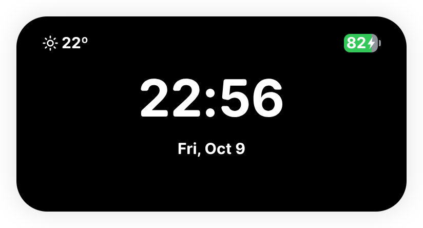

<p align="center">
  
</p>

<h1 align="center">Ripple Next</h1>

<p align="center"><strong>Your next action, close at hand.</strong></p>
<p align="center">A Dynamic Island desktop companion for Windows, macOS and Linux.</p>

<p align="center">
  <a href="README.zh-CN.md">简体中文</a> ·
  <a href="README.zh-TW.md">繁體中文</a> ·
  <strong>English</strong> ·
  <a href="README.ja.md">日本語</a>
</p>

<p align="center">
  <a href="https://github.com/ArsvineZhu/Ripple-Next/releases">Download</a> ·
  <a href="instructions.md">User guide</a> ·
  <a href="https://github.com/ArsvineZhu/Ripple-Next/issues">Feedback</a>
</p>

Music is playing. A link needs opening. A copied command is somewhere in your clipboard. You remember one more thing to do. Ripple Next brings these small actions into one floating Island, so you can reach them without turning each one into another window.

Start with a compact glance, hover for quick information, and click to open a full feature page. The Island changes size with its content, moves between pages with animated transitions, and lets the surrounding desktop keep receiving your clicks.

<p align="center">
  
</p>

> Screenshots show the running Linux application with sample media, AI responses, clipboard, weather and battery data. Read the [4.0.0 release notes](docs/releases/4.0.0.en.md) for the complete update.

## Eight pages, one place to return to

| Page                       | What you can do                                                                                                                                            |
| -------------------------- | ---------------------------------------------------------------------------------------------------------------------------------------------------------- |
| **Browser Search**         | Send a search or a direct HTTP(S) address to your default browser. Choose your own search URL template.                                                    |
| **Workflows & Quick Apps** | Open a group of apps and webpages in order, or launch one favorite directly. Quick apps support installed apps, URLs and commands with separate arguments. |
| **Overview**               | Check the time, date, weather and battery together. Choose 12/24-hour time, a time zone, a weather location and Celsius/Fahrenheit.                        |
| **Now Playing**            | See the song and artwork, pause or resume, skip tracks, and bring the player forward. Scroll vertically to choose among multiple players.                  |
| **AI Assistant**           | Use your own OpenAI-compatible endpoint and model. Read streamed Markdown answers and copy code blocks.                                                    |
| **Clipboard**              | Reuse recently copied text with a copy button beside each entry. History stays in the current session.                                                     |
| **Tasks**                  | Add a quick to-do and check it off when finished. Your remaining tasks survive a restart.                                                                  |
| **Settings**               | Make the Island fit your screen, habits and language: appearance, placement, visible pages, startup behavior and more.                                     |

## Music without the window hunt

Keep the album cover and playback controls nearby while you work. Compact mode shows the track; hovering reveals a play/pause control. The expanded card gives you artwork, artist, previous/next controls and a way to bring the player forward.

When more than one player is open, the music page becomes a vertical stack of cards:

- **A** is the first page and restores Automatic selection.
- Each **dot** represents a player. Scroll, click a dot, or use Up/Down after focusing the music area.
- Selecting a player keeps it selected for this run until it disappears. Controls always address the player on that card.
- One continuous wheel/trackpad stroke moves one page. The first and last music pages are boundaries; horizontal gestures still navigate the Island's feature pages.

Artwork comes from the player's media metadata. Local Linux covers also work when a browser supplies a temporary filename without an image extension. A missing or failed cover gets a clean music placeholder.

<p align="center">
  
</p>

Media integration uses Windows system media sessions, Linux MPRIS, and running Spotify/Music applications on macOS. Available controls and artwork depend on the player; see [platform compatibility](docs/platform-compatibility.md).

## Open your work together

Give a workflow a name, add the apps or addresses you use together, then launch that group from one button. A development workflow can open documentation and `localhost:3000/`; local addresses are sent to the default browser with HTTP, including their paths and query strings.

Keep individual favorites on the Quick Apps strip. Choose an installed application, an HTTP(S) URL, or a command with one argument per line and an optional working directory. A failed launch appears beside that item; a workflow continues with its remaining targets and reports a failure on its own row.

<p align="center">
  
</p>

## An assistant with your choice of provider

Configure a Base URL, model name and API key in Settings, then ask directly from the Island. Answers arrive as a stream, render as Markdown, and provide copy buttons for code. The answer view grows with the content and scrolls when it reaches the available screen height.

Use **Ask another** to clear the current exchange and start a new question. Ripple Next provides the interface; you bring the endpoint and model. Questions use the service you configure.

The API key is protected with the operating system's encryption . On Linux, key saving requires an available OS-backed encryption service. Prompts and answers go to the endpoint you configure.

<p align="center">
  
</p>

## Keep everyday details within reach

The overview puts a readable clock beside weather and battery information. The clock follows your chosen time zone; weather follows the location you set. The battery badge fills to its percentage and turns green while charging. Charging and device activity can also surface as brief status alerts.

<p align="center">
  
</p>

Clipboard history and tasks take care of two different kinds of loose ends: text you may need again, and things you still need to finish. Copy a clipboard entry with one click; add a task and check it off when done. Text history remains temporary, while tasks are saved locally.

<table>
  <tr>
    <td></td>
    <td></td>
  </tr>
</table>

## Make the Island yours

- **Place it where it belongs.** Select a display, use a snap position, or adjust its free position.
- **Choose the appearance.** Default, Sleek Black and Windows 95 themes; custom colors, an image URL or a local background file; an optional border.
- **Keep the pages you use.** Reorder or hide feature pages and choose the default page. Settings remains available.
- **Control when it stays visible.** Compact, hover and expanded modes; inactive hiding, Quick Standby, Large Standby and a configurable 0–2000 ms pointer-leave delay.
- **Fit your desktop routine.** Startup control and background mode, with platform-specific behavior described in the guides.
- **Use your language.** 简体中文, 繁體中文, English and 日本語. The interface follows the system by default; a manual choice applies immediately and is remembered.

<p align="center">
  
</p>

## Try Ripple Next

This version is **Ripple Next 4.0.0**, the first stable release. Explore the [release notes](docs/releases/4.0.0.en.md), then choose a `RippleNext-…` package for your platform from [Releases](https://github.com/ArsvineZhu/Ripple-Next/releases).

| Platform | Published build targets         | Packages                      |
| -------- | ------------------------------- | ----------------------------- |
| Windows  | x64                             | MSI installer or portable ZIP |
| macOS    | Intel x64 / Apple Silicon arm64 | DMG or portable ZIP           |
| Linux    | x64                             | DEB, RPM or portable ZIP      |

Install the package for your platform, or extract its portable ZIP and launch Ripple Next. Hover over the Island, click its background to expand, then visit Settings. Local features can be used before AI is configured. See the [user guide](instructions.md) for your first workflow and detailed controls, and [platform compatibility](docs/platform-compatibility.md) for native permissions and limitations.

### Run the current source

Use Node **22.23.3** from [.node-version](.node-version) and the pinned pnpm **12.9.1** from [package.json](package.json):

```sh
git clone https://github.com/ArsvineZhu/Ripple-Next.git
cd Ripple-Next
pnpm install --frozen-lockfile
pnpm start
```

The [developer guide](docs/development.md) owns setup prerequisites, checks, packaging and platform troubleshooting. Main/preload changes require restarting the application; a renderer hot update alone does not load them.

## Local data and external services

Settings, tasks, workflows and quick apps are saved in Ripple Next's own local database. API-key ciphertext is protected through the OS encryption service. Clipboard history lasts for the session; AI exchanges remain in the current session.

Searches and webpages open in the system browser. Weather uses the configured location with an external weather service. AI uses your configured endpoint. Local diagnostics omit API keys, clipboard text, prompts and answers; crash-report uploads are disabled. Minidumps are process snapshots and should be reviewed before sharing.

Ripple Next uses its own profile. Installed-app targets remain platform-specific when you move a profile to another OS.

## Explore, contribute, report

- [User guide](instructions.md) — modes, navigation, all eight pages and troubleshooting.
- [Documentation catalog](docs/INDEX.md) — development, release validation and current platform behavior.
- [Repository map](INDEX.md) — source ownership and configuration boundaries.
- [Contributing](CONTRIBUTING.md) — checks, documentation and localization expectations.
- [Issues](https://github.com/ArsvineZhu/Ripple-Next/issues) — report the version, OS and steps needed to reproduce a problem.

## License and credit

Ripple Next is developed by [Arsvine Zhu](https://github.com/ArsvineZhu) from [TopMyster's original Ripple](https://github.com/TopMyster/Ripple). It continues the Dynamic Island idea with its own product identity, persistence and cross-platform work. Released under the [MIT license](LICENSE); original attribution is retained.
