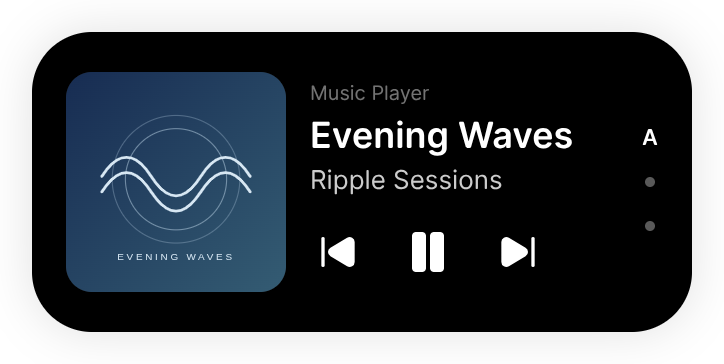
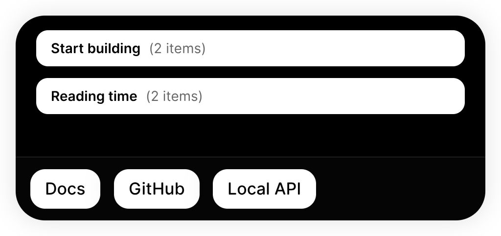
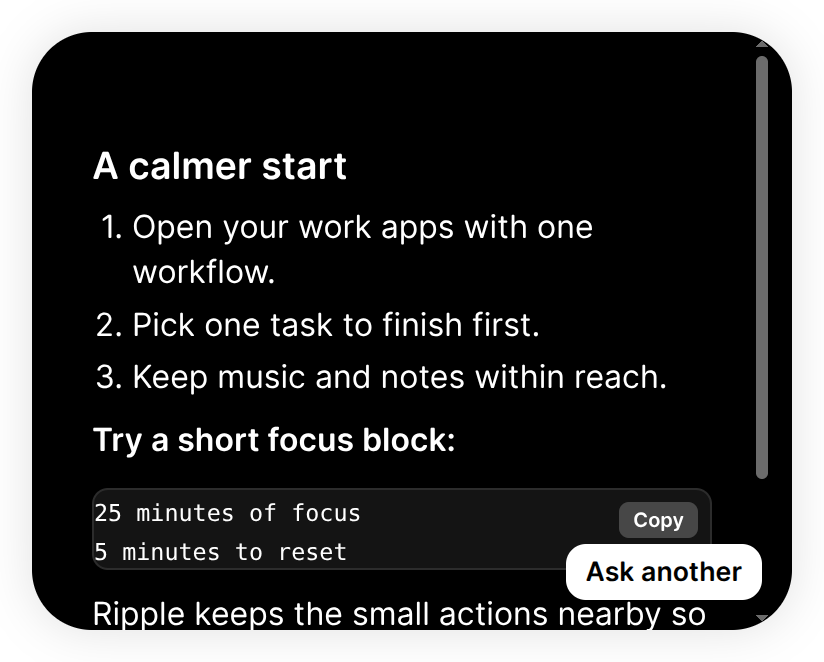
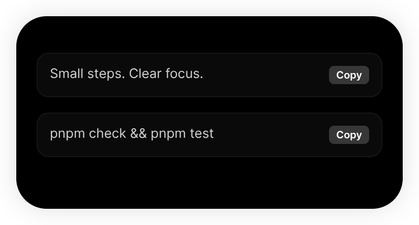
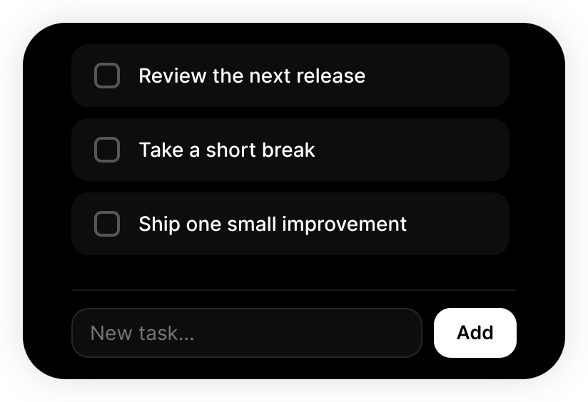
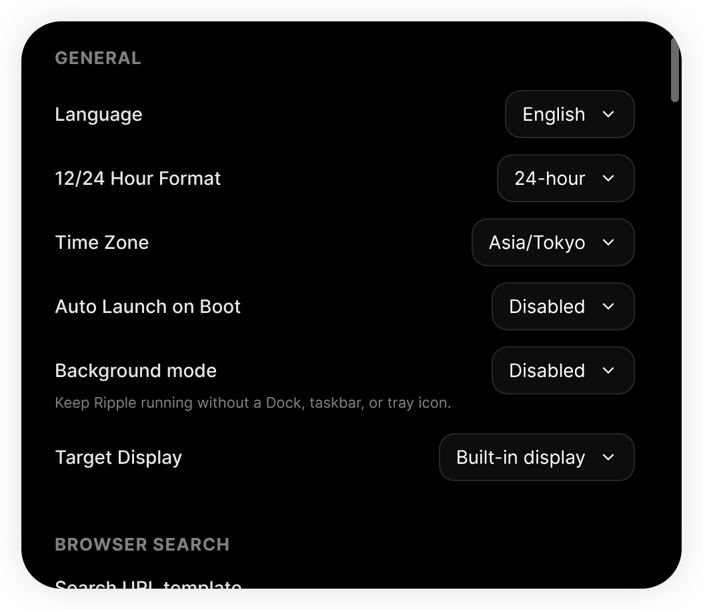

<p align="center">
  
</p>

<h1 align="center">Ripple Next</h1>

<p align="center"><strong>把桌面的常用动作，收进一座灵动岛。</strong></p>
<p align="center">适用于 Windows、macOS 和 Linux 的 Dynamic Island 桌面助手。</p>

<p align="center">
  <strong>简体中文</strong> ·
  <a href="README.zh-TW.md">繁體中文</a> ·
  <a href="README.md">English</a> ·
  <a href="README.ja.md">日本語</a>
</p>

<p align="center">
  <a href="https://github.com/ArsvineZhu/Ripple-Next/releases">下载</a> ·
  <a href="instructions.zh-CN.md">使用指南</a> ·
  <a href="https://github.com/ArsvineZhu/Ripple-Next/issues">反馈问题</a>
</p>

音乐正在播放，临时想打开一个网址，刚复制的命令又找不到了，还记起一件待办。Ripple Next 把这些零碎却高频的操作放进桌面上的一座悬浮岛，让你少切一次窗口，继续手头的事。

平时保持紧凑，悬停查看简短信息，点击展开完整功能页。岛的大小会随内容变化，切换页面时有连续的动画过渡；岛之外的桌面仍然可以正常点击。

<p align="center">
  
</p>

> 截图来自真实运行的 Linux 应用，媒体、AI 回答、剪贴板、天气和电量使用演示内容。完整更新见 [4.0.0 正式版说明](docs/releases/4.0.0.zh-CN.md)。

## 主要页面与入口

| 页面                 | 可以做什么                                                                                                 |
| -------------------- | ---------------------------------------------------------------------------------------------------------- |
| **浏览器搜索**       | 把搜索词或 HTTP(S) 地址交给默认浏览器，支持自定义搜索网址模板。                                            |
| **工作流与快捷应用** | 按顺序打开一组应用和网页，或者直接启动一个常用入口；快捷应用支持已安装应用、网址，以及参数独立填写的命令。 |
| **概览**             | 一眼查看时间、日期、天气和电量；选择 12／24 小时制、时区、天气地点与摄氏／华氏单位。                       |
| **正在播放**         | 查看歌曲与封面，暂停／继续、切换曲目、唤起播放器；多个播放器之间可上下滚动选择。                           |
| **AI 助手**          | 接入自己的 OpenAI 兼容接口和模型，阅读流式 Markdown 回答，一键复制代码块。                                 |
| **剪贴板**           | 找回最近复制的文字，每项都有复制按钮；历史仅保留在当前会话。                                               |
| **待办**             | 随手添加任务，完成后勾选移除；未完成的任务会保存到下次启动。                                               |
| **设置**             | 按屏幕、习惯和语言调整岛：外观、位置、页面顺序、启动行为等。                                               |

## 音乐控制，始终在手边

不必为了暂停一首歌而寻找播放器窗口。紧凑视图展示曲目，悬停后可快速暂停或继续；展开卡片后，封面、歌手和上一首／下一首控制都在眼前。点击封面区域还能唤起对应播放器。

同时开启多个播放器时，音乐页会变成上下排列的卡片：

- 第一页 **A** 表示自动选择，选择它即可恢复自动模式。
- 每个**圆点**对应一个播放器。可上下滚动、点击圆点，或聚焦音乐区域后使用上下方向键。
- 手动选择会在本次运行中锁定该播放器，直到它退出；播放控制始终针对卡片上的播放器。
- 每段连续滚轮／触控板手势切换一页，音乐页到达首尾后停止；横向手势仍用于切换岛的功能页。

封面来自播放器发布的媒体元数据。Linux 浏览器提供的无图片扩展名临时封面也能显示；未提供或解码失败时，显示整洁的音乐占位图。

<p align="center">
  
</p>

媒体能力分别接入 Windows 系统媒体会话、Linux MPRIS，以及 macOS 上正在运行的 Spotify／Music。可用控制和封面取决于播放器，具体详见[平台兼容说明](docs/platform-compatibility.zh-CN.md)。

## 一次打开，一起开始

给工作流起个名字，填写一起使用的应用或网址，然后点击一个按钮启动整组入口。开发场景下，可以同时打开文档和 `localhost:3000/`；本地地址会自动补上 HTTP，保留路径及查询参数，交给系统默认浏览器。

单个常用入口则放在快捷应用栏：选择已安装应用、填写 HTTP(S) 网址，或输入可执行命令、每行一个参数和可选工作目录。启动失败会出现在对应项旁；工作流会继续尝试剩余目标，并在自己的行内报告失败。

<p align="center">
  
</p>

## AI 助手，由你选择

在设置中填入 Base URL、模型名称和 API 密钥，就能直接从岛里提问。回答逐步流入，以 Markdown 排版；代码块有独立复制按钮。回答区域会随内容增高，达到屏幕可用高度后滚动查看。

点击**再问一个**，清除当前问答并开始新问题。Ripple Next 提供交互界面，由你选择服务端与模型；应用不附带 AI 订阅，也不提供会话历史服务。

API 密钥通过操作系统加密保护。Linux 保存密钥需要可用的系统加密服务。提问和回答交给你配置的接口处理。

<p align="center">
  
</p>

## 让日常有地安放

概览把清晰的时钟、日期、天气和电量放在一起。时间跟随所选时区，天气跟随配置地点；电池徽标按百分比填充，充电时变绿。充电与设备活动也能以短暂状态提示出现。

<p align="center">
  
</p>

剪贴板负责“可能还要用的文字”，待办负责“还没完成的事情”。点一下即可重新复制历史条目；随手添加任务，完成后勾选。文字历史是临时的，待办会保存在本地。

<table>
  <tr>
    <td></td>
    <td></td>
  </tr>
</table>

## 按你的桌面习惯调整

- **放在顺手的位置。** 选择显示器，使用吸附位置，或调节自由位置。
- **选择喜欢的外观。** 默认、Sleek Black 和 Windows 95 主题；自定义颜色、图片网址或本地背景；可选边框。
- **留下常用的页面。** 重排或隐藏功能页，选择默认页面；设置页始终可用。
- **决定什么时候显示。** 紧凑、悬停和展开视图；非活动时隐藏、快速待机、展开待机，以及 0–2000 ms 的鼠标离开延迟。
- **融入启动习惯。** 开机启动；macOS 可开关菜单栏图标，Windows／Linux 始终保留托盘。平台差异见指南。
- **使用熟悉的语言。** 简体中文、繁體中文、English、日本語；默认跟随系统，手动选择立即生效，并在重启后保留。

<p align="center">
  
</p>

## 开始使用

本次版本为 **Ripple Next 4.0.0 正式版**，完整更新见[发布说明](docs/releases/4.0.0.zh-CN.md)。前往 [Releases](https://github.com/ArsvineZhu/Ripple-Next/releases) 下载对应平台的 `RippleNext-…` 软件包。

| 平台    | 发布构建目标                   | 安装形式             |
| ------- | ------------------------------ | -------------------- |
| Windows | x64                            | MSI 安装包或便携 ZIP |
| macOS   | Intel x64／Apple Silicon arm64 | DMG 或便携 ZIP       |
| Linux   | x64                            | DEB、RPM 或便携 ZIP  |

安装对应平台的软件包，或解压便携 ZIP 后运行 Ripple Next。悬停查看简短信息，点击岛的背景展开，再进入设置。配置 AI 之前，也可以先使用本地功能。初次配置及完整操作见[使用指南](instructions.zh-CN.md)，原生权限与限制见[平台兼容说明](docs/platform-compatibility.zh-CN.md)。

### 运行当前源码

使用 [.node-version](.node-version) 中的 Node **22.23.3**，以及 [package.json](package.json) 固定的 pnpm **12.9.1**：

```sh
git clone https://github.com/ArsvineZhu/Ripple-Next.git
cd Ripple-Next
pnpm install --frozen-lockfile
pnpm start
```

依赖、检查、打包和平台排查由[开发指南](docs/development.zh-CN.md)统一说明。修改主进程或 preload 后需要重启应用，仅更新 renderer 不会载入这些改动。

## 本地数据与外部服务

设置、待办、工作流和快捷应用保存到 Ripple Next 自己的本地数据库。API 密钥的密文由系统加密服务保护。剪贴板历史仅保留在当前会话；AI 问答暂未持久化。

搜索和网页交给系统浏览器；天气服务会接收配置的地点；AI 使用你配置的接口。本地诊断不会记录 API 密钥、剪贴板文字、提问或回答，崩溃报告不自动上传。Minidump 是进程快照，分享前应自行检查。

Ripple Next 使用独立配置。把配置移到另一操作系统时，已安装应用的启动目标仍有平台限制。

## 继续了解与参与

- [使用指南](instructions.zh-CN.md)：模式、导航、页面与常见排查。
- [文档目录](docs/INDEX.zh-CN.md)：开发、发布验证与当前平台行为。
- [仓库地图](INDEX.zh-CN.md)：源码归属与工具配置边界。
- [贡献规范](CONTRIBUTING.zh-CN.md)：检查、文档和语言同步要求。
- [问题反馈](https://github.com/ArsvineZhu/Ripple-Next/issues)：请提供版本、操作系统和可复现步骤。

## 许可与致谢

Ripple Next 由 [Arsvine Zhu](https://github.com/ArsvineZhu) 基于 [TopMyster 的原版 Ripple](https://github.com/TopMyster/Ripple) 继续开发，延续灵动岛的交互理念，并拥有独立的产品身份、数据存储和跨平台适配。采用 [MIT 许可证](LICENSE)，保留原项目归属。
